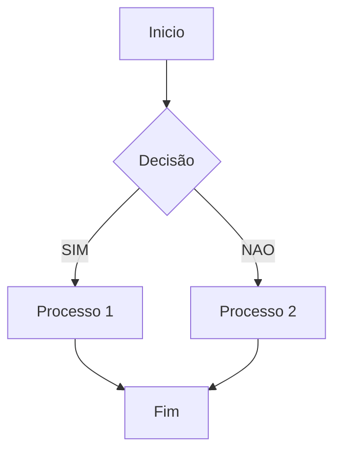
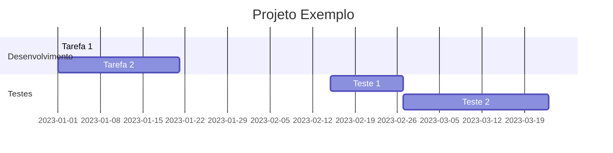

# Diagrama 

## Mermaid
Mermaid é uma ferramenta poderosa que permite criar diagramas e fluxogramas a partir de texto simples, utilizando uma sintaxe específica. Integrar Mermaid em seus documentos markdown
pode enriqueccer a apresetnacao de  informações complexas de maneira visual.

